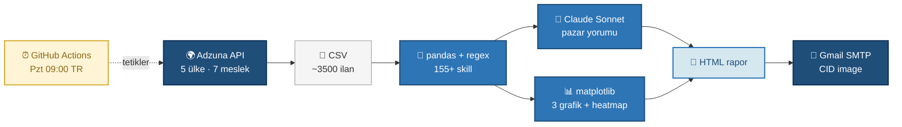

# 🌍 Global IT İş İlanı Pazar Analiz Sistemi

> Yapay zeka, bulut teknolojileri ve veri mühendisliği gibi alanların hızla dönüştüğü IT sektöründe **hangi becerilerin yükselişte olduğunu, hangilerinin geri planda kaldığını ve coğrafyaya göre nasıl farklılaştığını** takip etmek için geliştirilmiş **uçtan uca otomatik bir pazar analiz sistemi**.

Her hafta otomatik çalışır, **5 ülkeden 3,500+ IT iş ilanını** toplar, **AI ile yorumlar** ve HTML rapor olarak e-posta gönderir.

---

## 📊 Sistem Mimarisi



---

┌────────────────┐     ┌─────────┐     ┌──────────────┐     ┌────────────┐
│  Adzuna API    │ ──> │   CSV   │ ──> │   pandas     │ ──> │  Claude AI │
│  (5 ülke)      │     │ (raw)   │     │  + regex     │     │  (Sonnet)  │
└────────────────┘     └─────────┘     └──────┬───────┘     └─────┬──────┘
│                   │
▼                   ▼
┌──────────────────────────────┐
│  HTML rapor + 3 matplotlib   │
│  grafiği (heatmap dahil)     │
└──────────────┬───────────────┘
│
▼
┌──────────────────┐
│  Gmail (CID img) │
└──────────────────┘
                      ┌──────────────────────────────┐
                      │  GitHub Actions cron job     │
                      │  Her Pazartesi 09:00 (TR)    │
                      └──────────────────────────────┘

---

## 🚀 Versiyon İlerlemesi

| Özellik | v1.0 | v2.0 (mevcut) |
|---|---|---|
| **Ülke sayısı** | 3 (UK, DE, US) | **5** (UK, DE, US, IN, PL) |
| **Meslek grubu** | 3 rol | **7 ana grup** |
| **Haftalık ilan hacmi** | ~900 | **~3,500** |
| **Skill listesi** | 60+ | **155+** |
| **Skill bulunma oranı** | %44 | **%54** (Hibrit AI ile %85 hedef) |
| **Grafik sayısı** | 2 | **3** (heatmap eklendi) |
| **Maaş analizi kapsamı** | UK + US | **UK + US + DE + PL** |
| **Veri kalite katmanı** | yok | Tarih filtresi (180 gün) + duplicate temizliği |

---

## 🎯 Kapsanan IT Meslek Grupları

1. Makine Öğrenmesi Mühendisi
2. Veri Mühendisi
3. Bulut Mühendisi / Mimarı
4. Siber Güvenlik Mühendisi
5. DevOps / Platform Mühendisi
6. Veri Analisti / İş Analisti
7. Yazılım Mühendisi

## 🌐 Kapsanan Pazarlar

| Ülke | Veri Toplama | Maaş Analizi | Para Birimi |
|---|---|---|---|
| 🇺🇸 ABD | ✅ | ✅ | USD |
| 🇬🇧 İngiltere | ✅ | ✅ | GBP |
| 🇩🇪 Almanya | ✅ | ✅ | EUR |
| 🇵🇱 Polonya | ✅ | ✅ | PLN |
| 🇮🇳 Hindistan | ✅ | ❌ (ölçek farkı) | INR |

---

## 🛠️ Teknolojiler

**Diller & Kütüphaneler:**
`Python` · `pandas` · `numpy` · `matplotlib` · `requests` · `regex` · `smtplib` · `python-dotenv`

**API & Veri:**
`Adzuna REST API` · `Anthropic Claude API` · `JSON` · `CSV`

**DevOps & Otomasyon:**
`Git` · `GitHub` · `GitHub Actions (CI/CD)` · `YAML cron`

**Diğer:**
`MIME multipart email` · `CID image attachment` · `Environment variables` · `Prompt engineering`

---

## 📁 Proje Yapısı

| Dosya | Görev |
|-------|-------|
| `main_scraper.py` | 1. Adzuna'dan 5 ülke × 7 grup veri çekme |
| `analyzer.py` | 2. CSV'yi analiz et, JSON özet üret |
| `ai_analyzer.py` | 3. Claude Sonnet ile pazar yorumu |
| `chart_generator.py` | 4. 3 matplotlib grafiği (heatmap dahil) |
| `report_builder.py` | 5. HTML rapor + grafik gömme |
| `email_sender.py` | 6. Gmail SMTP, CID image attachment |
| `main_runner.py` | Tüm pipeline'ı tek komutla çalıştırır |
| `.github/workflows/haftalik_rapor.yml` | GitHub Actions: Her Pazartesi 09:00 (TR) |

---

## 🏃 Hızlı Başlangıç

```bash
# 1. Repoyu klonla
git clone https://github.com/selinsserra/it-pazar-analiz.git
cd it-pazar-analiz

# 2. Sanal ortam oluştur ve aktive et
python3 -m venv venv
source venv/bin/activate    # Mac/Linux
# venv\Scripts\activate     # Windows

# 3. Bağımlılıkları yükle
pip install -r requirements.txt

# 4. .env dosyasını doldur (.env.example'a bak)
cp .env.example .env
# Düzenle: ADZUNA_*, ANTHROPIC_*, GMAIL_* anahtarlarını ekle

# 5. Tüm pipeline'ı çalıştır
python3 main_runner.py
```

### Manuel adım adım çalıştırma

```bash
python3 main_scraper.py      # ~3 dk: veri topla
python3 analyzer.py          # ~5 sn: analiz et
python3 ai_analyzer.py       # ~10 sn: AI yorumu al
python3 chart_generator.py   # ~3 sn: grafikleri üret
python3 report_builder.py    # ~1 sn: HTML rapor
python3 email_sender.py      # ~3 sn: e-postayı gönder
```

---

## 📋 Veri Kalitesi Notları

Profesyonel veri analizinde **kaynağı sorgulamak** kritiktir. Bu projedeki bilinçli kararlar:

- **180 gün filtresi**: Adzuna API arşivinden gelen 2019-2024 ilanları analiz dışında — sadece güncel pazarı yansıtır
- **Çift ilan temizliği**: `ilan_url` bazında deduplicate
- **Hindistan maaş hariç**: INR ölçeği diğer ülkelerden farklı (1 USD ≈ 83 INR), doğrudan karşılaştırma yanıltıcı olur
- **Almanya maaş varyans**: Almanya'da ilanlarda maaş paylaşma kültürü düşük, örnek boyutu küçük
- **Adzuna açıklama 5000 karakter**: API limiti, gerçek skill talebi raporlanandan daha yüksek olabilir
- **Hibrit skill çıkarım** (yapım aşamasında): Regex eksik kalan ilanlar için Claude Haiku fallback ile %85 hedef

---

## 💰 İşletme Maliyeti

| Servis | Maliyet | Not |
|---|---|---|
| Adzuna API | $0 | Ücretsiz tier (25 req/dk yeterli) |
| Claude API | ~$0.05/hafta | Sonnet 4.5 ile pazar yorumu |
| Gmail SMTP | $0 | Kişisel hesap üzerinden |
| GitHub Actions | $0 | Açık kaynak repo için ücretsiz |
| **Toplam (aylık)** | **~$0.20** | |

---

## 🎓 Proje Boyunca Öğrenilen Konseptler

- **REST API entegrasyonu** ve rate limit yönetimi
- **pandas** ile çok değişkenli analiz (groupby, crosstab, deduplicate)
- **Regex tabanlı bilgi çıkarımı** ve `\b` (word boundary) kullanımı
- **Prompt engineering**: system + user message ayrımı, redundancy prensibi
- **MIME multipart email** ve **CID image attachment**
- **Environment variable security**: `.env` + `.gitignore` + GitHub Secrets
- **CI/CD with GitHub Actions**: cron syntax, YAML workflow, artifacts
- **Defansif programlama**: try/except, returncode, defense in depth (ikili filtreleme)

---

## 📜 Lisans
# 🌍 Global IT İş İlanı Pazar Analiz Sistemi

> Yapay zeka, bulut teknolojileri ve veri mühendisliği gibi alanların hızla dönüştüğü IT sektöründe **hangi becerilerin yükselişte olduğunu, hangilerinin geri planda kaldığını ve coğrafyaya göre nasıl farklılaştığını** takip etmek için geliştirilmiş **uçtan uca otomatik bir pazar analiz sistemi**.

Her hafta otomatik çalışır, **5 ülkeden 3,500+ IT iş ilanını** toplar, **AI ile yorumlar** ve HTML rapor olarak e-posta gönderir.

---

**Akış:** Adzuna API'den gelen ham ilan verisi → pandas ile temizlenip skill çıkarımı yapılır → paralel olarak hem Claude AI yorumlanır hem matplotlib grafikleri üretilir → ikisi tek HTML raporda birleşir → Gmail SMTP ile gönderilir. Tüm sistem GitHub Actions ile her Pazartesi 09:00'da (TR saati) otomatik tetiklenir.

## 🚀 Versiyon İlerlemesi

| Özellik | v1.0 | v2.0 (mevcut) |
|---|---|---|
| **Ülke sayısı** | 3 (UK, DE, US) | **5** (UK, DE, US, IN, PL) |
| **Meslek grubu** | 3 rol | **7 ana grup** |
| **Haftalık ilan hacmi** | ~900 | **~3,500** |
| **Skill listesi** | 60+ | **155+** |
| **Skill bulunma oranı** | %44 | **%54** (Hibrit AI ile %85 hedef) |
| **Grafik sayısı** | 2 | **3** (heatmap eklendi) |
| **Maaş analizi kapsamı** | UK + US | **UK + US + DE + PL** |
| **Veri kalite katmanı** | yok | Tarih filtresi (180 gün) + duplicate temizliği |

---

## 🎯 Kapsanan IT Meslek Grupları

1. Makine Öğrenmesi Mühendisi
2. Veri Mühendisi
3. Bulut Mühendisi / Mimarı
4. Siber Güvenlik Mühendisi
5. DevOps / Platform Mühendisi
6. Veri Analisti / İş Analisti
7. Yazılım Mühendisi

## 🌐 Kapsanan Pazarlar

| Ülke | Veri Toplama | Maaş Analizi | Para Birimi |
|---|---|---|---|
| 🇺🇸 ABD | ✅ | ✅ | USD |
| 🇬🇧 İngiltere | ✅ | ✅ | GBP |
| 🇩🇪 Almanya | ✅ | ✅ | EUR |
| 🇵🇱 Polonya | ✅ | ✅ | PLN |
| 🇮🇳 Hindistan | ✅ | ❌ (ölçek farkı) | INR |

---

## 🛠️ Teknolojiler

**Diller & Kütüphaneler:**
`Python` · `pandas` · `numpy` · `matplotlib` · `requests` · `regex` · `smtplib` · `python-dotenv`

**API & Veri:**
`Adzuna REST API` · `Anthropic Claude API` · `JSON` · `CSV`

**DevOps & Otomasyon:**
`Git` · `GitHub` · `GitHub Actions (CI/CD)` · `YAML cron`

**Diğer:**
`MIME multipart email` · `CID image attachment` · `Environment variables` · `Prompt engineering`

---

## 📁 Dosya Yapısı

Pipeline 6 ana scriptten ve 1 orchestrator'dan oluşur:

| Dosya | Görev |
|-------|-------|
| `main_scraper.py` | 1️⃣ Adzuna'dan 5 ülke × 7 meslek grubu veri çekme |
| `analyzer.py` | 2️⃣ CSV'yi temizle, analiz et, JSON özet üret |
| `ai_analyzer.py` | 3️⃣ Claude Sonnet ile pazar yorumu üret |
| `chart_generator.py` | 4️⃣ 3 matplotlib grafiği (heatmap dahil) |
| `report_builder.py` | 5️⃣ HTML rapor + grafik gömme (base64) |
| `email_sender.py` | 6️⃣ Gmail SMTP, CID image attachment |
| `main_runner.py` | Tüm pipeline'ı tek komutla çalıştırır |
| `.github/workflows/haftalik_rapor.yml` | GitHub Actions cron — her Pazartesi 09:00 (TR) |

**Çıktı dosyaları** (her hafta tarih damgalı, `data/` klasöründe):
- `ilanlar_YYYY-MM-DD.csv` — ham veri (~3500 ilan)
- `analiz_YYYY-MM-DD.json` — istatistik özet
- `ai_yorum_YYYY-MM-DD.json` — Claude pazar yorumu
- `chart_skiller/roller/maaslar_YYYY-MM-DD.png` — 3 grafik
- `rapor_YYYY-MM-DD.html` — e-posta gönderimine hazır HTML

---

## 🏃 Hızlı Başlangıç

```bash
# 1. Repoyu klonla
git clone https://github.com/selinsserra/it-pazar-analiz.git
cd it-pazar-analiz

# 2. Sanal ortam oluştur ve aktive et
python3 -m venv venv
source venv/bin/activate    # Mac/Linux
# venv\Scripts\activate     # Windows

# 3. Bağımlılıkları yükle
pip install -r requirements.txt

# 4. .env dosyasını doldur (.env.example'a bak)
cp .env.example .env
# Düzenle: ADZUNA_*, ANTHROPIC_*, GMAIL_* anahtarlarını ekle

# 5. Tüm pipeline'ı çalıştır
python3 main_runner.py
```

### Manuel adım adım çalıştırma

```bash
python3 main_scraper.py      # ~3 dk: veri topla
python3 analyzer.py          # ~5 sn: analiz et
python3 ai_analyzer.py       # ~10 sn: AI yorumu al
python3 chart_generator.py   # ~3 sn: grafikleri üret
python3 report_builder.py    # ~1 sn: HTML rapor
python3 email_sender.py      # ~3 sn: e-postayı gönder
```

---

## 📋 Veri Kalitesi Notları

Profesyonel veri analizinde **kaynağı sorgulamak** kritiktir. Bu projedeki bilinçli kararlar:

- **180 gün filtresi**: Adzuna API arşivinden gelen 2019-2024 ilanları analiz dışında — sadece güncel pazarı yansıtır
- **Çift ilan temizliği**: `ilan_url` bazında deduplicate
- **Hindistan maaş hariç**: INR ölçeği diğer ülkelerden farklı (1 USD ≈ 83 INR), doğrudan karşılaştırma yanıltıcı olur
- **Almanya maaş varyans**: Almanya'da ilanlarda maaş paylaşma kültürü düşük, örnek boyutu küçük
- **Adzuna açıklama 5000 karakter**: API limiti, gerçek skill talebi raporlanandan daha yüksek olabilir
- **Hibrit skill çıkarım** (yapım aşamasında): Regex eksik kalan ilanlar için Claude Haiku fallback ile %85 hedef

---

## 💰 İşletme Maliyeti

| Servis | Maliyet | Not |
|---|---|---|
| Adzuna API | $0 | Ücretsiz tier (25 req/dk yeterli) |
| Claude API | ~$0.05/hafta | Sonnet 4.5 ile pazar yorumu |
| Gmail SMTP | $0 | Kişisel hesap üzerinden |
| GitHub Actions | $0 | Açık kaynak repo için ücretsiz |
| **Toplam (aylık)** | **~$0.20** | |

---

## 🎓 Proje Boyunca Öğrenilen Konseptler

- **REST API entegrasyonu** ve rate limit yönetimi
- **pandas** ile çok değişkenli analiz (groupby, crosstab, deduplicate)
- **Regex tabanlı bilgi çıkarımı** ve `\b` (word boundary) kullanımı
- **Prompt engineering**: system + user message ayrımı, redundancy prensibi
- **MIME multipart email** ve **CID image attachment**
- **Environment variable security**: `.env` + `.gitignore` + GitHub Secrets
- **CI/CD with GitHub Actions**: cron syntax, YAML workflow, artifacts
- **Defansif programlama**: try/except, returncode, defense in depth (ikili filtreleme)

